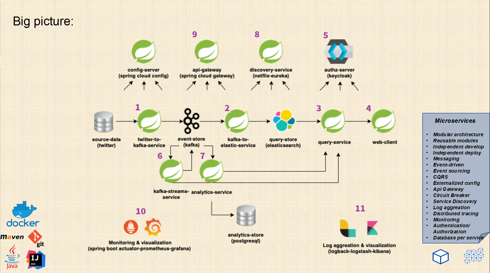

# Microservices Demo

## Покрываемые проектом темы

* **Микросервисная архитекрура** Назависимые в разработке, деплое и масштабировании сервисы
* стек **Spring Boot** и **Spring Cloud**
* **Паттерны Микросервисов**:
    * **Вынесение конфигурационных файлов** Spring Cloud Config
    * **Версионирование API**
    * **Service Discovery** Eureka
    * **API Gateway** Spring Cloud Gateway
    * **Circuit Breaker** Spring Cloud Gateway & resilience4j
    * **Rate limiting** ( against DDoS ) Spring Cloud Gateway & Redis
    * **Event sourcing** Kafka
    * **CQRS** Kafka & Postgres & Elasticsearch
    * **Authentication / Authorization** при помощи **oAuth2** и **OpenId** Keycloak server
    * **Мониторинг** Prometheus & Grafana
    * **Distributed tracing, log aggregation and visualisation** ELK (Elasticsearch + Logstash + Kibana)
* **Apache Kafka** brokers, topics, partitions, producer, consumer, Spring Kafka
* **Elasticsearch** Index API, Query API, Spring Elastic Data
* **Контейнеризация при помощи Docker и Docker Compose**
* **Reactive Development** Spring Elastic Reactive Library, Spring Boot Reactive Rest Client, Reactive Thymeleaf

## Описание проекта и последовательности разработки

#### 1.Twitter-to-kafka-service
* Spring Boot
* Kafka basics
* Spring-kafka(producer)
* Kafka Avro
* Kafka admin
* Docker Kafka
* Maven basics
* Logback
* Twitter4j 
* Externalize Configuration pattern
    * define config git repository
    * connect to GitHub
    * security configuration
    * enable encryption for sensitive data
    
#### 2.Kafka-to-elastic-service
* Elasticsearch basics
* Elastic index
* Docker elastic 
* Spring-elastic
* Spring-kafka(consumer)

#### 3.Query-service
* Spring Web
* Hateoas
* Controller advice
* API versioning
* Elastic query
* Open Api docs
* Reactive query with Elastic

#### 4.Web-client
* Spring Webсlient
* Spring Thymeleaf
* Bootstrap
* Reactive webclient and thymeleaf
* Client side Load balancing

#### 5.Authz-service (Keycloak)
* Keycloak Authz server docker
* OAuth2, OpenId connect
* JWT
* Spring oauth2 resource server
* Spring oauth2 client
* Single sign-on (SSO)

#### 6.Kafka-stream-service
* Kafka streams
* Kafka key/value stores

#### 7.Analytics-service
* Spring Data (PostgreSQL)
* CRUD
* Batch inserts with Spring Data Jpa

#### 8.Discovery-service
* Service discovery and registration witn Netflix Eureka
* High availability

#### 9.Api-gateway
* Spring cloud gateway
* Client side load balancing
* Circuit breaker & fallbacks with resilience4j
* Rate limiting with Redis
* Docker redis

#### 10.Monitoring & Visualisation
* Spring Boot Actuator
* Prometheus metrics
* Grafana visualisation

#### 11.Log aggregation & Visualisation
* Log aggregation
* Distributed tracing
* Logback & Logstash
* Kibana visualisation

## Создане Twitter-to-kafka-service

